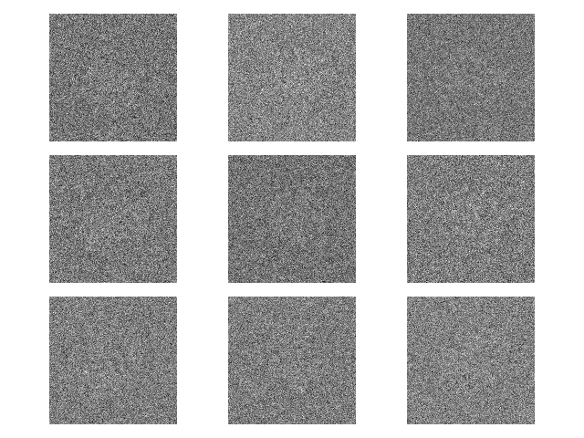

# Simptcl: a tool for rapidly simulating realistic cryo-EM particles

     
    

Simptcl allows for generation of arbitrary, realistic cryo-EM datasets derived from known ground truth volumes. Such datasets are useful for developing and benchmarking cryo-EM reconstruction and analysis tools. Simptcl has two scripts designed to be used sequentially: 
1. `project3d.py` : takes as input a 3D volume and a pose sampling scheme, and produces corresponding noiseless 2D projections of the volume. 
2. `acn.py` : takes as input the  2D projections, global SNR, and CTF parameters per-particle, and produces corresponding noisy + CTF-corrupted particles. 

# Installation and usage
### Installation
Both scripts require various components of [cryoDRGN](https://github.com/zhonge/cryodrgn) for internal calculations and data handling; additionally, the pose and ctf inputs are expected as cryoDRGN-formatted .pkl files. Following cryodrgn installation and cryodrgn conda env activation, clone this repo: `git clone https://github.mit.edu/bmp/simptcl.git`

### Usage
`python project3d.py volume.mrc noiseless_projections.mrcs [--in-pose poses.pkl | --healpy-grid RESOLUTION | --so3-random NIMGS] --outpose sampled_poses.pkl`

`python acn.py noiseless_projections.mrcs realistic_projections.mrcs [--ctf ctf.pkl | --dfu DEFOCUS_U --dfv DEFOCUSV ...] --snr1 1.4 --snr2 0.05`

Additional options are visible via `python project3d.py --help` or `python acn.py --help`. Notably, both project3d.py and acn.py can additionally take a .txt file as input specifying a tilt series stage tilt scheme (simulating corresponding rotations+projections and tilt-dependent sample thickness weighting, respectively). Users may also find it useful to generate a .star file from the pose and ctf .pkl metadata generated by simptcl. CryoDRGN has such a function:

`cryodrgn write_starfile realistic_projections.mrcs --ctf ctf.pkl --poses sampled_poses.pkl -o simptcl.star`

# Background and implementation
### Background
`project3d.py` offers three possible pose determination schemes: (1) user-provided poses, (2) uniform spherical projection sampling at specified resolutions using `healpy`, or (3) poses sampled from SO3 (therefore randomly sampled from a uniform distribution of spherical projections). 

`acn.py` follows the sequential (1) structural noise --> (2) CTF --> (3) shot noise cryo-EM image formation model described in [Baxter et al, 2009](https://doi.org/10.1016%2Fj.jsb.2009.02.012). Both noise  processes are modeled as the real-space addition of gaussian noise with independent standard deviations. CTF is modeled following standard cryo-EM procedures. 

### Implementation and system requirements
Both scripts are built using a pytorch/cuda framework to leverage GPU acceleration. Simptcl can simulate 1M particles at 100 x 100 px in ~ 5 minutes on a system equipped as follows: CPU: Intel Xeon Gold 6242R; GPU: Nvidia RTX 3090; RAM: 512 GB.

However, the (Nvidia) GPU is not required, and RAM is predominantly used to hold a single copy of the particle stack in memory with np.float32 precision (4 bytes per pixel). Therefore, the particle stack described above could be simulated on a system with ~48 GB RAM and an older / no GPU.